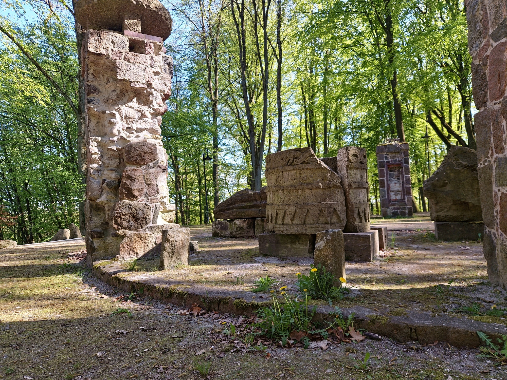
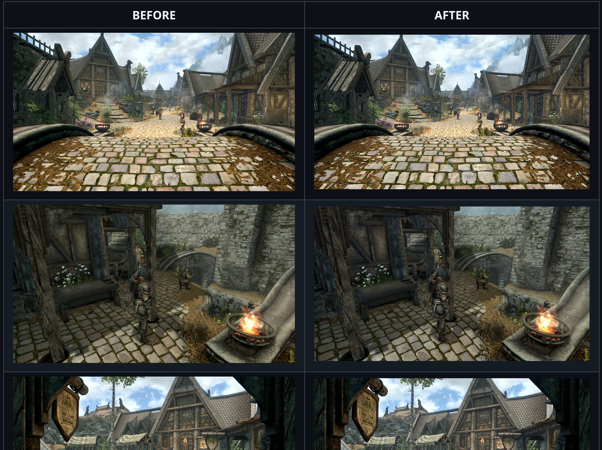
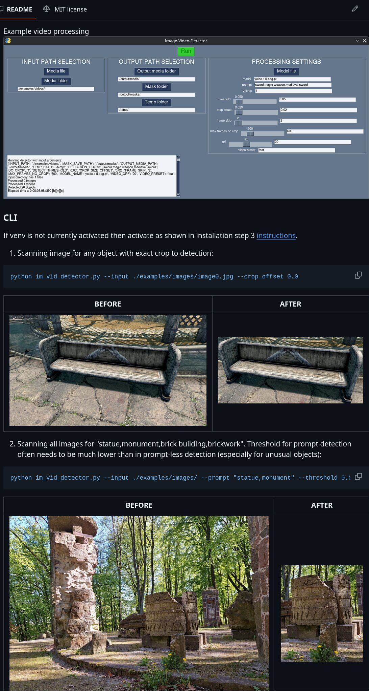

  
  

If you are interested in cooperation then you contact me via email: krzysztof.bogunia.kontakt@gmail.com.  

## Example results of my projects are presented below:

### Result 1 – cherrypk_pixel_stacker, greater image sharpness at different distances from the camera.  
|     BEFORE      |      AFTER     |
| :-------------: | :------------: |
|   statue_original0 |   statue_stacked |  

### Result 2 – cherrypk_pixel_stacker, calibrated preset (FDVanilla_Reshade) with LUT for a game with colder colors and sharper image.  

### Result 3 – im-vid-detector, prompt based object detection.  

